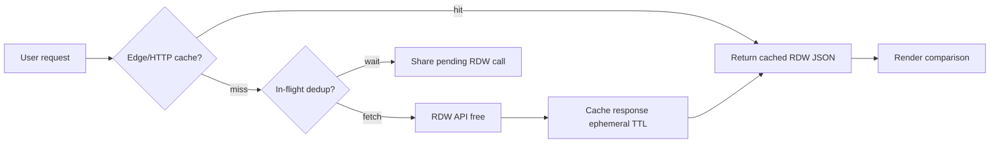
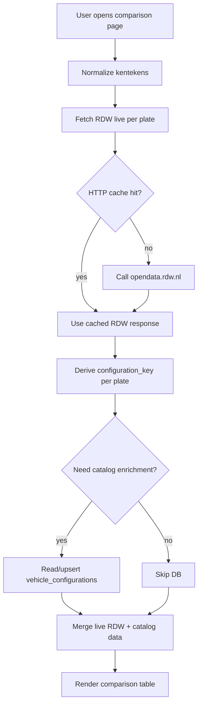

# Data ingestion plan

Roadmap for filling the Kentekenvergelijker database. Read this before adding migrations, ingest scripts, or API clients for vehicle data.

**Internal only.** This document describes architecture and data sources for developers and agents. None of this belongs in user-facing copy, SEO, metadata, or error messages. See `cursor.md` (User-facing copy).

> **Addendum (plate enrichment).** On-demand specification enrichment runs in `lib/enrichment/` when a user opens a comparison: used-car listings are searched by kenteken first (Gaspedaal, AutoTrack), then catalog specs are merged from `vehicle_configurations` matched by brand, model, trim, and engine. Results are cached per plate in `plate_specification_values` (24h TTL). The shared catalog is seeded offline into Supabase; runtime code never scrapes brochures. Dev tools: `npm run debug:plate`, `npm run verify:catalog`.

## Goals

- Compare **specific registered cars** by Dutch license plate (`kenteken`), not brochure-level specs.
- Use **only free, publicly accessible APIs**. No paid services, no API keys that cost money, no commercial kentekenrapport providers.
- **Do not store one row per license plate in the database.** Plate lookups go to the RDW API live. The database holds shared catalog data only (configurations, equipment).

## Hard constraints (for humans and AI)

1. **100% free data sources only.** Do not integrate Finnik, VWE, DAT, AutoDNA, overheid.io paid tiers, or similar commercial option/spec APIs unless the user explicitly changes this policy.
2. **RDW Open Data is the primary source.** Base URL: `https://opendata.rdw.nl/resource/{dataset_id}.json`
3. **No per-plate database table.** Do not create `registered_vehicles`, `license_plates`, or any table keyed by `kenteken`. The Dutch fleet is ~9M vehicles; we never want a growing mirror of that.
4. **Live RDW fetch per comparison.** User enters kentekens → server calls RDW → render comparison. Plate-specific data (color, APK, catalog price) comes from the API response, not Postgres.
5. **Database = catalog only.** Persist `vehicle_configurations` (and later `vehicle_equipment`) keyed by homologation identity. Many plates share one configuration row.
6. **No VIN-based decoding** as a default strategy. VIN is not in RDW open data (privacy), and VIN decode services are typically paid.
7. **Map Dutch API fields to English** in application code. Dutch is fine for UI labels.

## Architecture: live API + small catalog DB

```
User enters kentekens
        |
        v
  RDW API (live)  -----------------> Comparison UI
  vehicle + fuel                         |
        |                                |
        +-- derive configuration_key ----+
        |
        v
  vehicle_configurations (DB, optional upsert)
  + vehicle_equipment (DB, future)
```

**What lives where:**

| Data | Source | Stored in DB? |
| --- | --- | --- |
| Color, APK, catalog price, registration dates | RDW live | No |
| Brand, model, fuel, power, doors | RDW live (+ config cache) | Config row only (shared) |
| Homologation / TGK technical data | RDW TGK datasets | Config row (shared) |
| Equipment, consumer trim | TBD (free-only) | Config or equipment table (shared) |

Two cars with the same homologation code share one `vehicle_configurations` row. The database grows with **unique configurations encountered**, not with every plate ever looked up.

## RDW cost and terms

RDW open data is **always free in money terms** under the current policy. There is no paid tier, no per-request billing, and no subscription.

| Topic | Policy |
| --- | --- |
| Cost | **€0.** "Voor de afname van open data via dit kanaal brengt de RDW geen kosten in rekening." ([bijsluiter](https://www.rdw.nl/over-rdw/dienstverlening/open-data/bijsluiter)) |
| Commercial use | Allowed. CC0 license. Build a commercial product on top of it. |
| Registration | Not required. Free Socrata app token is optional but recommended for production. |
| Availability | **No SLA.** RDW disclaims uptime, accuracy, and continuity. Service can change or stop. |
| Throughput | **Fair use.** Performance is not unlimited; abusive traffic can be throttled (HTTP 429). |

**Free does not mean unlimited throughput.** It means no invoice, not no limits. The constraint at scale is throttling and reliability, not cost.

### What stays free even at high traffic

- Every RDW API call remains €0 at 100 DAU or 100,000 DAU.
- Commercial use does not change the price.
- Registering an app token remains free.

### What can break at high traffic (still free, but degraded)

- HTTP 429 throttling if too many requests hit RDW uncached.
- HTTP 500 errors during RDW outages (happens occasionally).
- Slower response times under load.

## API call budget

Each comparison fetches RDW live per plate. Minimum calls:

| Plates in comparison | RDW calls (vehicle + fuel per plate) |
| --- | --- |
| 2 | 4 |
| 3 | 6 |
| 4 | 8 |

### Rough daily volume examples

Assume 1 comparison per user, 2 plates average (4 calls each):

| DAU | RDW calls/day | Avg calls/hour (24h spread) | Peak hour (~5× avg) |
| --- | --- | --- | --- |
| 100 | 400 | ~17 | ~85 |
| 1,000 | 4,000 | ~167 | ~835 |
| 5,000 | 20,000 | ~833 | ~4,200 |
| 10,000 | 40,000 | ~1,667 | ~8,300 |

Peak hours (evenings) concentrate traffic. **10,000 DAU without caching can mean 8,000+ RDW calls in a single peak hour.** That will throttle. With caching, actual RDW calls depend on unique plates looked up, not raw DAU.

### Rate limits (free infrastructure)

| Setup | Behavior |
| --- | --- |
| No app token | Shared IP pool, strict throttling. Dev only. |
| Free Socrata app token | Private request pool, much higher limits. Socrata docs cite ~1,000 requests/rolling hour as a baseline; registered apps are generally not throttled unless abusive. |
| Token + HTTP cache | Same free quota, but most repeat lookups never reach RDW. |

Register a free app token at [opendata.rdw.nl](https://opendata.rdw.nl/) (Developer Settings). Pass via `X-App-Token` header. Add `RDW_APP_TOKEN` to `.env.local`.

## Caching strategy (no per-plate database)

Use **short-lived HTTP cache**, not Postgres, for plate lookups:

- Next.js `fetch` with `next: { revalidate: N }` keyed by normalized kenteken + dataset
- Or `unstable_cache` with the same TTL
- Cache lives in the deployment layer, expires automatically, never grows to millions of DB rows

Suggested TTL by field stability:

| Data | Changes how often | Suggested cache TTL |
| --- | --- | --- |
| Brand, model, fuel, power, homologation | Rarely (car identity) | 24 hours |
| Color, catalog price | Occasionally | 6-12 hours |
| APK expiry date | Can change after inspection | 1-6 hours |

Start with a flat 1-hour TTL in Phase 1. Tune per field when traffic grows.

**Never** solve scale by creating a `registered_vehicles` table. If HTTP cache is not enough, add Redis or edge cache (still ephemeral, not a fleet mirror).

## Scale plan (future growth)

Staged plan as usage increases. Each stage stays on free RDW data. Costs are engineering effort only, not API fees.

### Stage 0: Launch (0-500 DAU)

**Status:** Phase 1 implementation target.

- Live RDW fetch per comparison.
- Free Socrata app token in production.
- Flat 1-hour HTTP cache on all RDW fetches.
- Parallel fetches for all plates in one comparison.
- Retry once on 5xx, friendly error on 429 or second failure.

**Expected RDW load:** Low. No special infrastructure.

### Stage 1: Early growth (500-5,000 DAU)

**Trigger:** Occasional 429 responses or RDW latency spikes in logs.

- Increase cache TTL for stable fields (homologation, brand, model) to 24h.
- Keep shorter TTL for APK and color.
- Add basic monitoring: count RDW calls, cache hit rate, 429 rate per hour.
- Log normalized kenteken on cache miss (not in DB) to understand unique plate volume.

**Expected RDW load:** ~4,000-20,000 calls/day raw; much less with cache.

### Stage 2: Significant traffic (5,000-10,000 DAU)

**Trigger:** Sustained 429s during peak hours despite Next.js cache.

- Add **shared edge cache** (e.g. Vercel KV, Upstash Redis, or similar). Still ephemeral, keyed by `rdw:{dataset}:{plate}`, not Postgres.
- Cache full RDW JSON response per plate per dataset.
- Stale-while-revalidate: serve cached data immediately, refresh in background.
- Request deduplication: if 10 users compare the same plate simultaneously, only 1 RDW call in flight.
- Contact RDW via the [open data forum](https://groups.google.com/g/voertuigen-open-data) to introduce the project. Still free; helps with fair-use visibility.

**Expected RDW load:** 20,000-40,000 calls/day without cache; target <5,000 actual RDW calls/day with 80%+ cache hit rate.

### Stage 3: High traffic (10,000+ DAU)

**Trigger:** Redis cache hit rate drops (long tail of unique plates) or RDW asks you to reduce load.

- **Do not** add a per-plate Postgres table. That remains excluded.
- Extend Redis TTL for homologation-stable responses to 24-72h.
- Pre-warm cache for trending plates if analytics show repeat patterns (e.g. plates from popular car listings).
- Rate-limit comparisons per IP/session as a last resort to protect RDW (e.g. max 10 comparisons/hour per IP). Prefer cache over rate limiting.
- Evaluate RDW bulk dataset download for **configuration catalog only** (TGK/homologation), not per-plate mirror. The full gekentekende_voertuigen CSV is ~9M rows and not practical to self-host for plate lookups.
- If RDW throughput is still insufficient at this stage, re-evaluate architecture with the user. Options remain free-only: stronger caching, request coalescing, off-peak background refresh. Paid APIs are out of policy unless the user changes it.

**Expected RDW load:** Dominated by cache miss rate on unique plates, not DAU directly.

### Stage summary

| Stage | DAU | Primary defense | Still free? |
| --- | --- | --- | --- |
| 0 Launch | 0-500 | App token + 1h HTTP cache | Yes |
| 1 Early growth | 500-5K | Tiered TTL + monitoring | Yes |
| 2 Significant | 5K-10K | Redis/edge cache + dedup | Yes |
| 3 High | 10K+ | Longer TTL + pre-warm + RDW forum contact | Yes |



## Risks and mitigations

| Risk | Mitigation |
| --- | --- |
| RDW downtime / 500 errors | Retry once; show graceful partial comparison; serve stale cache if available |
| Rate limit 429 | App token; HTTP/Redis cache; stale-while-revalidate; friendly "probeer later" message |
| Latency (~200-500ms per call) | Parallel fetches; cache hits are instant |
| RDW API field changes | Map in application code; raw jsonb on config rows for catalog data |
| RDW stops or changes dataset | Monitor [RDW open data forum](https://groups.google.com/g/voertuigen-open-data); architecture allows swapping source for catalog layer |
| Long-tail unique plates at scale | Accept higher RDW call volume for novel plates; cache still helps for popular plates |

## What RDW gives us (free)

Per license plate, from dataset `m9d7-ebf2` (Gekentekende voertuigen):

| RDW field (Dutch) | Use in app |
| --- | --- |
| `kenteken` | Display only (from live response) |
| `merk` | `brand` |
| `handelsbenaming` | `model_name` |
| `voertuigsoort` | `vehicle_type` |
| `inrichting` | `body_type` |
| `eerste_kleur` | `primary_color` (live only) |
| `aantal_deuren` | `door_count` |
| `catalogusprijs` | `catalog_price` (live only) |
| `vervaldatum_apk` / `vervaldatum_apk_dt` | `apk_expiry_date` (live only) |
| `typegoedkeuringsnummer` | `type_approval_number` |
| `variant` | `variant` |
| `uitvoering` | `rdw_configuration_code` |
| `volgnummer_wijziging_eu_typegoedkeuring` | `eu_type_approval_amendment_number` |
| `europese_voertuigcategorie` | `european_vehicle_category` |

Per license plate, from dataset `8ys7-d773` (Gekentekende voertuigen brandstof):

| RDW field (Dutch) | Use in app |
| --- | --- |
| `brandstof_omschrijving` | `fuel_type` |
| `netto_max_vermogen_elektrisch` / `nettomaximumvermogen` | `power_kw` |
| WLTP fields | Display from live response |

Optional supplementary RDW datasets (all free, per plate, live fetch):

| Dataset ID | Name |
| --- | --- |
| `vezc-m2t6` | Gekentekende voertuigen carrosserie |
| `jhie-znh9` | Gekentekende voertuigen carrosserie specificatie |
| `3huj-srit` | Gekentekende voertuigen assen |
| `kmfi-hrps` | Gekentekende voertuigen voertuigklasse |
| `2wi1-7t2k` | Gekentekende voertuigen APK |
| `j3wq-qf4v` | Terugroepacties |

Query pattern (SoQL):

```
GET https://opendata.rdw.nl/resource/m9d7-ebf2.json?kenteken={PLATE}&$limit=1
GET https://opendata.rdw.nl/resource/8ys7-d773.json?kenteken={PLATE}
```

Normalize `kenteken` before querying: uppercase, no dashes or spaces (`HGL33B`, not `HGL-33-B`). Use `lib/kenteken.ts` helpers.

## What RDW does NOT give us

| Desired UI field | Why RDW is not enough |
| --- | --- |
| Consumer trim name ("Life", "Style", "Business") | RDW `uitvoering` is a **type-approval code** (e.g. `E11AZ1`), not a marketing trim |
| Heated seats, lane assist, navigation, packages | Not in any free RDW dataset |
| Factory option list per individual car | Requires commercial data or manual curation |
| VIN / chassis number | Not in RDW open data |

The UI label "Uitvoering / pakket" should eventually show a consumer-friendly name from `vehicle_equipment` (Layer 2). Until then, show brand + model.

## Data model (two layers, no per-plate table)

```
kenteken --(live RDW)--> comparison UI
              |
              +-- configuration_key --(optional DB)--> vehicle_configurations
                                                          |
                                                          +--> vehicle_equipment (future)
```

### Layer 1: Live RDW (not in database)

Plate-specific and basic vehicle data. Fetched on every comparison request (with HTTP cache TTL).

### Layer 2: `vehicle_configurations` (exists in DB)

One row per unique homologated configuration. Populated optionally when a plate is looked up: derive `configuration_key`, upsert if new. Used for TGK enrichment and equipment lookup.

Already migrated in `supabase/migrations/20260614233540_vehicle_configurations.sql`.

Raw `rdw_vehicle` / `rdw_fuel` jsonb on this table stores a **representative snapshot** from any plate that shared this configuration, not a per-plate history.

### Layer 3: `vehicle_equipment` (future, TBD)

Equipment and consumer trim, keyed by `configuration_key`. **No free API chosen yet.**

## `configuration_key` derivation

Computed in application code from the live RDW response. Stable identity for catalog deduplication.

```
{type_approval_number}|{variant}|{rdw_configuration_code}|{eu_type_approval_amendment_number}
```

Example (KIA EV3, plate HGL33B):

```
e6*2018/858*00331*00|F5E22|E11AZ1|0
```

Rules:

- Use empty string for missing parts, but keep the pipe separators.
- Never use `kenteken` in the key.
- Upsert `vehicle_configurations` only when you need catalog enrichment. Phase 1 can skip DB writes entirely and still show a full comparison from live RDW alone.

## Request flow



Phase 1: steps A through E and L only. No database required for a working comparison.

## Type-approval enrichment (free, optional)

RDW TGK datasets are keyed by homologation identity, not kenteken. Join on `configuration_key` fields. Fetch once per configuration, store in `vehicle_configurations`.

| Dataset ID | Name |
| --- | --- |
| `byxc-wwua` | TGK Basis Uitvoering |
| `kyri-nuah` | TGK Merk Uitvoering |
| `gr7t-qfnb` | TGK Energiebron Uitvoering |
| `4by9-ammk` | TGK Aandrijving Uitvoering |
| `ky2r-jqad` | TGK Carrosserie Uitvoering |

## Implementation phases

### Phase 1: Live RDW comparison (start here)

**Delivers:** Real comparison table from live API. No new migrations. Covers **Scale Stage 0**.

1. `lib/rdw/client.ts` - typed fetch helpers for vehicle + fuel datasets.
2. `lib/rdw/map.ts` - Dutch RDW response to typed comparison objects.
3. `lib/rdw/cache.ts` - wrap fetches with Next.js revalidate (1 hour TTL).
4. `lib/vehicles/compare.ts` - fetch N plates in parallel, build comparison groups.
5. `scripts/fetch-rdw.mjs` - CLI to test live fetch: `node scripts/fetch-rdw.mjs HGL33B`
6. Wire `app/[...kentekens]/page.tsx` to call compare logic instead of placeholders.

Required for production: register free Socrata app token, add `RDW_APP_TOKEN` to `.env.local`.

Design `lib/rdw/cache.ts` as a pluggable layer so Stage 2 can swap in Redis without rewriting the client.

### Phase 2: Configuration catalog in DB

**Delivers:** Persisted homologation data for TGK enrichment and future equipment.

1. On comparison load, upsert `vehicle_configurations` by `configuration_key`.
2. Fetch TGK datasets for new configurations.
3. Extend comparison rows from enriched catalog data.

### Phase 3: Equipment and consumer trim (free-only TBD)

**Delivers:** Stoelverwarming, rijassistentie, navigatie, consumer uitvoering names.

Keyed by `configuration_key`, not kenteken. Requires a free-only data strategy.

### Phase 4: Scale infrastructure (when traffic demands it)

**Delivers:** Resilience at 5,000+ DAU. See **Scale plan** above. Not needed at launch.

1. Tiered cache TTLs by field stability (Stage 1).
2. RDW call / cache-hit / 429 monitoring (Stage 1).
3. Redis or edge cache behind `lib/rdw/cache.ts` (Stage 2).
4. In-flight request deduplication for concurrent identical plate lookups (Stage 2).
5. Stale-while-revalidate for cached responses (Stage 2).
6. RDW forum introduction and fair-use check-in (Stage 2-3).

## Code layout (planned)

```
lib/
  rdw/
    client.ts       # HTTP calls to opendata.rdw.nl
    map.ts          # RDW JSON -> typed objects
    cache.ts        # pluggable cache (HTTP now, Redis at Stage 2)
    types.ts        # RdwVehicle, RdwFuel, etc.
  vehicles/
    compare.ts      # parallel fetch + merge for N plates
    catalog.ts      # optional: upsert/read vehicle_configurations
  kenteken.ts       # existing: normalize, validate, format

scripts/
  fetch-rdw.mjs     # manual live-fetch test CLI
  test-db.mjs       # existing connectivity check
```

Future additions at scale (Phase 4):

```
lib/
  rdw/
    cache-redis.ts  # Redis-backed cache (Stage 2+)
    metrics.ts      # cache hit rate, 429 count (Stage 1+)
```

## Comparison table mapping (Phase 1)

| UI group | UI label | Source |
| --- | --- | --- |
| Algemeen | Merk & model | Live RDW `merk` + `handelsbenaming` |
| Algemeen | Uitvoering / pakket | "-" until Layer 3 |
| Algemeen | Kleur | Live RDW `eerste_kleur` |
| Algemeen | APK vervaldatum | Live RDW `vervaldatum_apk_dt` |
| Motor & aandrijving | Brandstof | Live RDW fuel dataset |
| Motor & aandrijving | Vermogen | Live RDW fuel dataset |
| Uitrusting & opties | Stoelverwarming, etc. | "-" until Layer 3 |

## Explicitly excluded

**APIs (without user approval):** Finnik, VWE, RDC, DAT, AutoDNA, overheid.io, VIN decode APIs.

**Catalog scraping is approved** for shared trim/equipment data only (see Addendum above). Per-plate scraping or per-plate storage remains excluded.

**Database patterns (always excluded):** Any table keyed by `license_plate` / `kenteken`. No fleet mirror.

## Testing checklist

### Phase 1 (launch)

- [ ] `scripts/fetch-rdw.mjs HGL33B` prints vehicle + fuel JSON
- [ ] Comparison page shows real live data for 2-4 valid plates
- [ ] Unknown plate shows "kenteken niet gevonden" without DB writes
- [ ] HTTP cache prevents duplicate RDW calls within TTL (verify in dev logs)
- [ ] `RDW_APP_TOKEN` set in production environment
- [ ] `npm run test:db` still passes (config table unchanged)

### Phase 4 (scale, when implemented)

- [ ] Cache hit rate measurable in logs or metrics
- [ ] 429 responses handled gracefully (no crash, user-friendly message)
- [ ] Concurrent requests for same plate trigger only one RDW call (dedup)
- [ ] Stale cache served when RDW returns 5xx

## Environment variables (planned)

| Variable | Required | Purpose |
| --- | --- | --- |
| `RDW_APP_TOKEN` | Production yes, dev optional | Free Socrata token, avoids IP throttling |
| `REDIS_URL` | Stage 2+ only | Ephemeral plate response cache (not Postgres) |

## Related files

- `supabase/migrations/20260614233540_vehicle_configurations.sql` - catalog table (optional until Phase 2)
- `lib/kenteken.ts` - plate normalization and validation
- `components/comparison-preview.tsx` - placeholder UI to replace in Phase 1
- `cursor.md` - project conventions (English DB names, no em dash)
